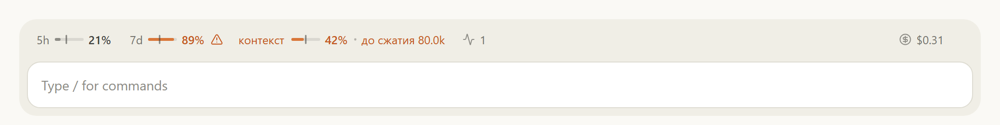
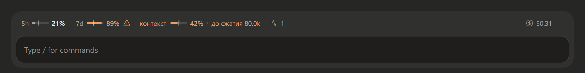
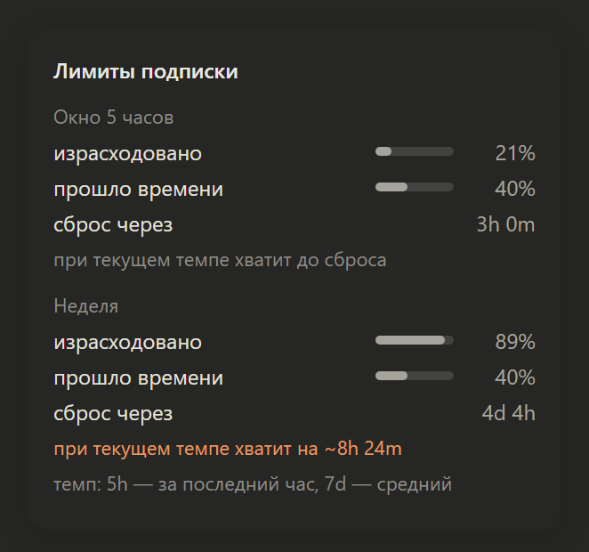
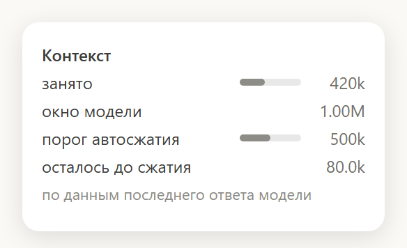
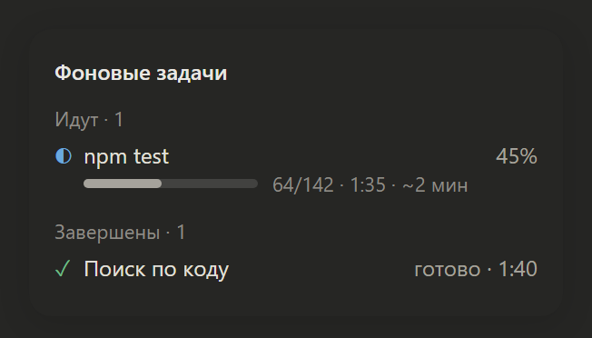
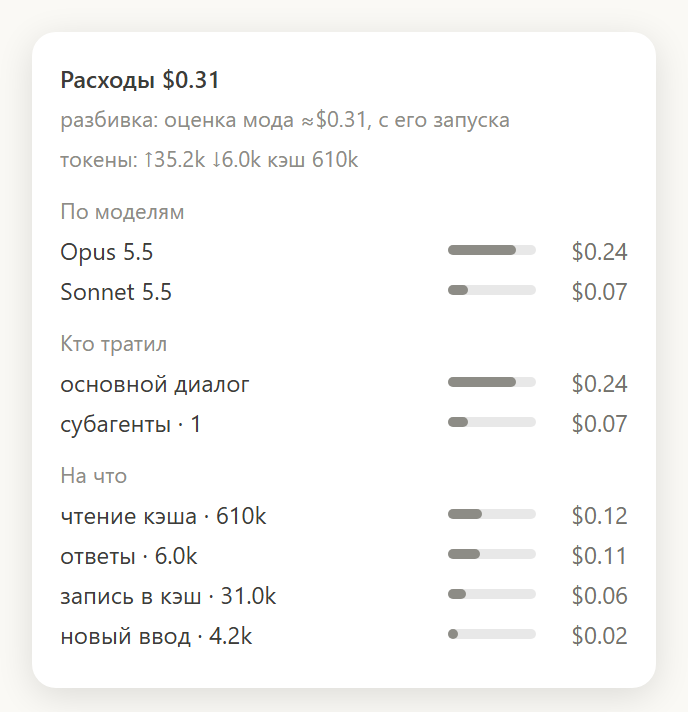

# usage-bar

Мод для Claude Code: полоса над полем ввода показывает, сколько израсходовано лимитов подписки, хватит ли их до сброса при текущем темпе, насколько заполнен контекст и сколько примерно стоит сессия.

Полоса нарисована в стиле самого приложения: серые подписи и тонкие шкалы, оранжевый цвет только там, где стоит посмотреть. Работает в приложении Claude (вкладка Code) в светлой и тёмной теме. В терминале вместо неё выводится одна строка текста.

## Что на полосе




Слева направо:

| Что | Что показывает |
| --- | --- |
| **5h** | Лимит пятичасового окна: шкала и сколько израсходовано, отметка на шкале — сколько времени окна прошло. |
| **7d** | То же для недельного лимита. |
| **⚠** | Если при текущем темпе лимит кончится раньше сброса, его шкала и процент становятся оранжевыми и рядом появляется знак. Для 5h темп считается за последний час, для недели — средний с её начала. Когда именно кончится и когда сброс — в подсказке при наведении. |
| **контекст** | Насколько заполнено окно модели, отметка — где сработает автосжатие, справа — сколько токенов до него. За 20% до порога становится оранжевым. |
| **Фоновые задачи** | Сколько фоновых команд и субагентов идёт сейчас (или сколько завершилось). |
| **$** | Стоимость сессии: цифра самого приложения, если оно её даёт, иначе оценка по ценам API. |

На 80% и 95% каждого лимита мод показывает уведомление, один раз на окно.

## Подсказки при наведении

У каждой части полосы есть карточка с подробностями.

**Лимиты**: израсходовано и прошло времени по каждому окну, время сброса и прогноз.



**Контекст**: занято, размер окна, порог автосжатия.



**Фоновые задачи**: что идёт сейчас, прогресс из вывода команды (`1200/2000`, `45%`, `[12/40]`) и примерное время до конца, ниже — что недавно завершилось.



**Расходы**: по моделям, основной диалог против субагентов, на что ушли деньги (ввод, ответы, кэш) и сколько токенов.



## Установка

Нужен Claude Code с поддержкой модов (плагинов с хуками-функциями). Мод проверен на версии 2.1.286. Лимиты на полосе появляются только при входе по подписке Claude: при работе по API-ключу лимитов нет, остальное работает.

### 1. Скачайте мод

```bash
git clone https://github.com/dimafaller-en/claude-code-usage-bar.git ~/.claude/mods/usage-bar
```

Папка может быть любой, дальше в примерах — `~/.claude/mods/usage-bar`.

### 2. Подключите его в настройках

Откройте `~/.claude/settings.json` (на Windows это `C:\Users\<имя>\.claude\settings.json`) и добавьте в блок `env` путь к папке мода:

```json
{
  "env": {
    "CLAUDE_CODE_PLUGIN_DIRS": "~/.claude/mods/usage-bar"
  }
}
```

Если блок `env` уже есть, добавьте в него только строку `CLAUDE_CODE_PLUGIN_DIRS`. Если там уже перечислены другие папки, разделяйте пути через `;` на Windows и через `:` на macOS и Linux.

Так мод загружается в каждой сессии, и в приложении, и в терминале.

### 3. Начните новую сессию

В приложении откройте новую сессию, в терминале запустите `claude` заново. Полоса появится после первого ответа модели: лимиты, контекст и токены приходят вместе с ним, поэтому до первого ответа полоса пустая.

### Только на одну сессию в терминале

Без правки настроек:

```bash
claude --plugin-dir ~/.claude/mods/usage-bar
```

### Проверка

Если полоса не появилась, проверьте мод:

```bash
claude plugin validate ~/.claude/mods/usage-bar
```

Причину отказа загрузки также видно в журнале при запуске `claude --debug`.

## Обновление

```bash
git -C ~/.claude/mods/usage-bar pull
```

Новая версия подхватится в следующей сессии. Чтобы открытые сессии приложения подхватывали изменения сразу, добавьте в тот же блок `env` строку `"CLAUDE_CODE_PLUGIN_DIR_WATCH": "1"`.

## Удаление

Уберите `CLAUDE_CODE_PLUGIN_DIRS` из `~/.claude/settings.json` и удалите папку мода.

## Что мод читает

Мод ничего не отправляет в сеть. Он берёт данные, которые приложение и так получает с каждым ответом модели: лимиты, токены, заполнение контекста, а для прогресса фоновых команд читает их вывод. Суммы токенов и расходов по сессиям хранятся в локальном хранилище Claude Code, чтобы пережить перезапуск приложения.

Стоимость, если приложение не даёт своей, — оценка по ценам API на 25.09.2026. При подписке это не реальный счёт, а то, сколько та же работа стоила бы по API.

## Для разработки

```bash
cd ~/.claude/mods/usage-bar
claude plugin test .
```

Код — в `hooks/`: `register.tsx` подключает хуки и рисует полосу, `draw.ts` считает и рисует полосу и карточки в SVG, `tasks.ts` разбирает вывод фоновых задач.

## Лицензия

[MIT](LICENSE). Иконки — [Lucide](https://lucide.dev) (лицензия ISC).
